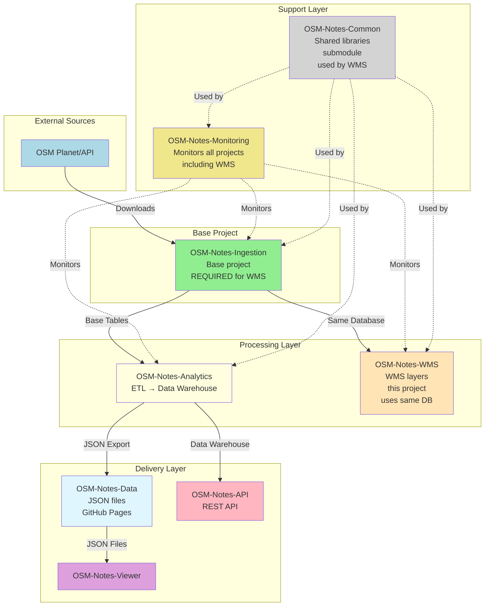
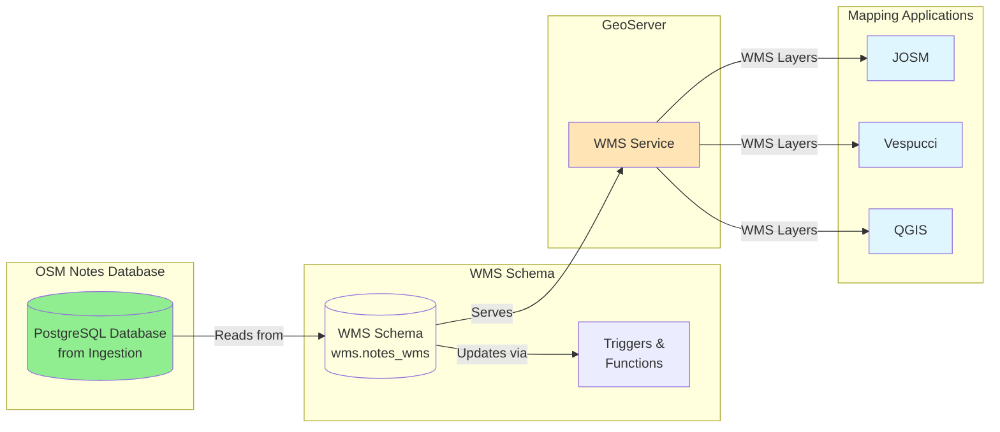

# OSM-Notes-WMS

**Web Map Service (WMS) for OpenStreetMap Notes**

This repository provides WMS (Web Map Service) layer publication for OSM notes, allowing mappers to
visualize note activity geographically in mapping applications like JOSM or Vespucci.

> **Note:** This project was extracted from
> [OSM-Notes-Ingestion](https://github.com/OSM-Notes/OSM-Notes-Ingestion) to provide focused
> documentation and maintainability. The WMS service requires access to a database populated by the
> OSM-Notes-Ingestion project.

## Overview

This project provides a complete WMS service that displays the location of open and closed OSM notes
on a map. The service allows mappers to:

- **Visualize note activity geographically**: View all notes in an area at once
- **Identify patterns**: Notice where many notes are clustered
- **Prioritize work**: Focus on areas that need attention
- **Track progress**: See which areas have been recently worked on

### Key Features

- **Geographic Visualization**: View notes on a map with their exact locations
- **Status Differentiation**: Distinguish between open and closed notes
- **Temporal Information**: Color coding based on note age
- **Real-time Updates**: Synchronized with the main OSM notes database via triggers
- **Country-based Styling**: Different colors and shapes per country for easy identification
- **Standard Compliance**: OGC WMS 1.3.0 compliant service via GeoServer

## 📚 Ecosystem Documentation

For shared documentation of the complete ecosystem, see:

- **[OSM Notes Ecosystem](https://github.com/OSM-Notes/OSM-Notes)** - Ecosystem landing page
- **[Global Glossary](https://github.com/OSM-Notes/OSM-Notes-Common/blob/main/docs/Glossary.md)** - Terms and definitions
- **[Complete Installation Guide](https://github.com/OSM-Notes/OSM-Notes-Common/blob/main/docs/Installation.md)** - Step-by-step installation of all projects
- **[End-to-End Data Flow](https://github.com/OSM-Notes/OSM-Notes-Common/blob/main/docs/Data_Flow.md)** - Complete data flow
- **[Decision Guide](https://github.com/OSM-Notes/OSM-Notes-Common/blob/main/docs/Decision_Guide.md)** - Which project do I need?

---

## OSM-Notes Ecosystem

This WMS project is part of the **OSM-Notes ecosystem**, consisting of 8 interconnected projects.
**OSM-Notes-Ingestion is the base project** - it was the first created and provides the foundation
for all others. **This WMS project requires Ingestion** as it uses the same database.

### Ecosystem Projects

1. **[OSM-Notes-Ingestion](https://github.com/OSM-Notes/OSM-Notes-Ingestion)** - **Base project** ⚠️ **REQUIRED**
   - Downloads and synchronizes OSM notes from Planet and API
   - Populates base PostgreSQL tables
   - First project created, foundation for all others
   - **This WMS project requires**: Ingestion database (uses same PostgreSQL database)

2. **[OSM-Notes-Analytics](https://github.com/OSM-Notes/OSM-Notes-Analytics)**
   - ETL processes and data warehouse
   - Generates analytics and datamarts
   - **Requires**: OSM-Notes-Ingestion (reads from base tables)

3. **[OSM-Notes-API](https://github.com/OSM-Notes/OSM-Notes-API)**
   - REST API for programmatic access
   - Provides dynamic queries and advanced features
   - **Requires**: OSM-Notes-Analytics (reads from data warehouse)

4. **[OSM-Notes-Viewer](https://github.com/OSM-Notes/OSM-Notes-Viewer)**
   - Web application for interactive visualization
   - Consumes JSON data from OSM-Notes-Data (GitHub Pages)
   - **Requires**: OSM-Notes-Data (which is generated by OSM-Notes-Analytics)

5. **[OSM-Notes-WMS](https://github.com/OSM-Notes/OSM-Notes-WMS)** (this project)
   - Web Map Service for geographic visualization
   - Publishes WMS layers for mapping applications (JOSM, Vespucci)
   - **Requires**: OSM-Notes-Ingestion (uses same database, schema `public`)

6. **[OSM-Notes-Monitoring](https://github.com/OSM-Notes/OSM-Notes-Monitoring)**
   - Centralized monitoring and alerting
   - Monitors all ecosystem components including this WMS service
   - **Requires**: Access to all other projects' databases/services

7. **[OSM-Notes-Common](https://github.com/OSM-Notes/OSM-Notes-Common)**
   - Shared Bash libraries and utilities
   - Used as Git submodule by multiple projects
   - **Used by**: Ingestion, Analytics, WMS (this project), Monitoring
   - Located at `lib/osm-common/` in this project

8. **[OSM-Notes-Data](https://github.com/OSM-Notes/OSM-Notes-Data)**
   - JSON data files exported from Analytics
   - Served via GitHub Pages
   - **Requires**: OSM-Notes-Analytics (generates and publishes the data)
   - **Consumed by**: Viewer (primary consumer), API (optional)

### Project Relationships



### Installation Order

When setting up the complete ecosystem, install projects in this order:

1. **OSM-Notes-Ingestion** - Install first (base project) ⚠️ **REQUIRED for WMS**
2. **OSM-Notes-WMS** (this project) - Requires Ingestion (uses same database)
3. **OSM-Notes-Analytics** - Requires Ingestion
4. **OSM-Notes-Data** - Requires Analytics (auto-generated by Analytics export script)
5. **OSM-Notes-Viewer** - Requires Data (consumes JSON from GitHub Pages)
6. **OSM-Notes-API** - Requires Analytics (reads from Analytics data warehouse)
7. **OSM-Notes-Monitoring** - Requires all others (monitors them)
8. **OSM-Notes-Common** - Used as submodule (no installation needed)

**Important**: WMS can be installed independently as long as Ingestion is installed first, since it only requires access to the Ingestion database.

## Architecture



## Recommended Reading Path

**New to this project?** Follow this reading path to understand WMS (~1 hour):

### For Administrators

1. **Start Here** (15 min)
   - Read this README.md (you're here!)
   - Understand the project purpose and main features
   - Review the Overview section above

2. **Installation and Setup** (30 min)
   - Review Prerequisites section below
   - Follow Quick Start guide
   - Verify installation with status commands

3. **Configuration and Usage** (15 min)
   - Review Configuration section
   - Read [docs/WMS_User_Guide.md](./docs/WMS_User_Guide.md) - How to use WMS in JOSM/Vespucci
   - Try Example 4: Using WMS in JOSM

**Total time: ~1 hour** for basic setup and usage.

### For Developers

1. **Foundation** (30 min)
   - [docs/WMS_Guide.md](./docs/WMS_Guide.md) - Complete technical guide (20 min)
   - Architecture section above - System architecture (10 min)

2. **Implementation** (30 min)
   - [bin/wms/README.md](./bin/wms/README.md) - Scripts documentation (15 min)
   - [sql/wms/README.md](./sql/wms/README.md) - SQL scripts documentation (15 min)

3. **Deep Dive** (as needed)
   - [sld/README.md](./sld/README.md) - Style files documentation
   - Review example scripts in Practical Examples section

**Total time: ~1.5 hours** for complete developer overview.

## Entry Points

**Main entry points** for using and operating WMS:

### Script Entry Points

1. **WMS Manager** (`bin/wms/wmsManager.sh`)
   ```bash
   # Main script for managing WMS layers
   ./bin/wms/wmsManager.sh [command] [options]
   
   # Available commands:
   ./bin/wms/wmsManager.sh create      # Create WMS layers
   ./bin/wms/wmsManager.sh update      # Update existing layers
   ./bin/wms/wmsManager.sh delete      # Delete layers
   ./bin/wms/wmsManager.sh status      # Check layer status
   ```

2. **GeoServer Configuration** (`bin/wms/geoserverConfig.sh`)
   ```bash
   # Configure GeoServer workspace and stores
   ./bin/wms/geoserverConfig.sh
   ```

See [bin/wms/README.md](./bin/wms/README.md) for complete script documentation.

### SQL Entry Points

1. **Create WMS Schema**
   ```bash
   # Run SQL scripts to create WMS schema and views
   psql -d your_database -f sql/wms/create_wms_schema.sql
   ```

2. **Create WMS Views**
   ```bash
   # Create views for notes and countries
   psql -d your_database -f sql/wms/create_wms_views.sql
   ```

See [sql/wms/README.md](./sql/wms/README.md) for complete SQL documentation.

### GeoServer Entry Points

**Production GeoServer**: `geoserver.osm.lat`

1. **WMS Service URL**
   - **Production**: `https://geoserver.osm.lat/geoserver/osm_notes/wms`
   - **Development**: `http://localhost:8080/geoserver/osm_notes/wms`

2. **GetCapabilities**
   - **Production**: `https://geoserver.osm.lat/geoserver/osm_notes/wms?service=WMS&version=1.1.0&request=GetCapabilities`
   - **Development**: `http://localhost:8080/geoserver/osm_notes/wms?service=WMS&version=1.1.0&request=GetCapabilities`

3. **GetMap** (example)
   - **Production**: `https://geoserver.osm.lat/geoserver/osm_notes/wms?service=WMS&version=1.1.0&request=GetMap&layers=osm_notes:notes&bbox=-180,-90,180,90&width=800&height=600&srs=EPSG:4326&format=image/png`
   - **Development**: `http://localhost:8080/geoserver/osm_notes/wms?service=WMS&version=1.1.0&request=GetMap&layers=osm_notes:notes&bbox=-180,-90,180,90&width=800&height=600&srs=EPSG:4326&format=image/png`

### Client Usage Entry Points

1. **JOSM** (Java OpenStreetMap Editor)
   - Add WMS layer: Right-click → Imagery → Add Imagery
   - **Production URL**: `https://geoserver.osm.lat/geoserver/osm_notes/wms`
   - **Development URL**: `http://localhost:8080/geoserver/osm_notes/wms`
   - See [docs/WMS_User_Guide.md](./docs/WMS_User_Guide.md) for detailed instructions

2. **Vespucci** (Mobile OSM Editor)
   - Add WMS layer via settings
   - **Production URL**: `https://geoserver.osm.lat/geoserver/osm_notes/wms`
   - **Development URL**: `http://localhost:8080/geoserver/osm_notes/wms`

3. **QGIS** (Desktop GIS)
   - Add WMS layer: Layer → Add Layer → Add WMS/WMTS Layer
   - **Production URL**: `https://geoserver.osm.lat/geoserver/osm_notes/wms`
   - **Development URL**: `http://localhost:8080/geoserver/osm_notes/wms`

### Configuration Entry Point

- **WMS Properties**: `etc/wms.properties.sh` - Main configuration file
  ```bash
  # Copy example and configure
  cp etc/wms.properties.sh.example etc/wms.properties.sh
  chmod 600 etc/wms.properties.sh
  vi etc/wms.properties.sh
  ```

## Prerequisites

Before installing WMS, ensure you have:

1. **PostgreSQL with PostGIS**
   - Database must be populated by
     [OSM-Notes-Ingestion](https://github.com/OSM-Notes/OSM-Notes-Ingestion)
   - Access to tables: `notes`, `countries` (schema `public`)
   - PostGIS extension installed

2. **GeoServer**
   - Version 2.18+ recommended
   - REST API access enabled
   - Java Runtime Environment installed

3. **Database Access**
   - Read/write access for WMS schema installation (user with CREATE/ALTER privileges)
   - Read-only access for GeoServer (user `geoserver` recommended)

### Verifying Database Schema Compatibility

Before installing WMS, verify that your database schema matches the expected schema from
OSM-Notes-Ingestion:

```bash
# Check if required columns exist in notes table
psql -d notes -c "
SELECT
  column_name,
  data_type
FROM information_schema.columns
WHERE table_name = 'notes'
  AND column_name IN ('note_id', 'created_at', 'closed_at', 'longitude', 'latitude', 'id_country')
ORDER BY column_name;
"

# Expected output should include:
# - note_id (integer or bigint)
# - created_at (timestamp or timestamp with time zone)
# - closed_at (timestamp or timestamp with time zone, nullable)
# - longitude (double precision or numeric)
# - latitude (double precision or numeric)
# - id_country (integer, nullable - optional but recommended)

# Check if countries table exists
psql -d notes -c "
SELECT EXISTS (
  SELECT 1 FROM information_schema.tables
  WHERE table_schema = 'public'
    AND table_name = 'countries'
);
"

# Verify PostGIS extension is installed
psql -d notes -c "SELECT PostGIS_Version();"
```

**Important:** The WMS installation script (`prepareDatabase.sql`) will automatically validate the
schema and report any missing columns. If validation fails, ensure you have the correct version of
OSM-Notes-Ingestion installed and that the database has been properly populated.

## Quick Start

### 1. Install WMS Database Components

```bash
# Navigate to project directory
cd OSM-Notes-WMS

# Copy and configure properties
cp etc/wms.properties.sh.example etc/wms.properties.sh
# Edit etc/wms.properties.sh with your database and GeoServer settings

# Install WMS database components (requires elevated privileges)
./bin/wms/wmsManager.sh install

# Verify installation
./bin/wms/wmsManager.sh status
```

### 2. Grant GeoServer Permissions

```bash
# Grant read-only permissions to geoserver user
psql -d notes -f sql/wms/grantGeoserverPermissions.sql
```

### 3. Configure GeoServer

```bash
# Configure GeoServer for WMS layers
./bin/wms/geoserverConfig.sh install

# Verify configuration
./bin/wms/geoserverConfig.sh status
```

### 4. Access WMS Service

- **WMS URL**: 
  - **Production**: `https://geoserver.osm.lat/geoserver/osm_notes/wms`
  - **Development**: `http://localhost:8080/geoserver/osm_notes/wms`
- **Layer Name**: `osm_notes:notes_wms_layer`
- **GetCapabilities**:
  - **Production**: `https://geoserver.osm.lat/geoserver/osm_notes/wms?service=WMS&version=1.1.0&request=GetCapabilities`
  - **Development**: `http://localhost:8080/geoserver/osm_notes/wms?service=WMS&version=1.1.0&request=GetCapabilities`

## Practical Examples

### Example 1: Complete Fresh Installation

```bash
# 1. Verify database schema compatibility
psql -d notes -f sql/wms/verifySchema.sql

# 2. Install WMS database components
./bin/wms/wmsManager.sh install

# 3. Grant GeoServer permissions
psql -d notes -f sql/wms/grantGeoserverPermissions.sql

# 4. Configure GeoServer
./bin/wms/geoserverConfig.sh install

# 5. Verify everything works
./bin/wms/wmsManager.sh status
./bin/wms/geoserverConfig.sh status

# 6. Test WMS service
curl "http://localhost:8080/geoserver/wms?SERVICE=WMS&VERSION=1.3.0&REQUEST=GetCapabilities" | grep -i "notes"
```

### Example 2: Updating After Database Changes

```bash
# After updating notes in the ingestion database, refresh WMS views
psql -d notes -c "REFRESH MATERIALIZED VIEW CONCURRENTLY wms.disputed_and_unclaimed_areas;"

# Or use the provided script
psql -d notes -f sql/wms/refreshDisputedAreasView.sql
```

### Example 3: Troubleshooting Connection Issues

```bash
# Check if GeoServer is accessible
curl -u admin:geoserver http://localhost:8080/geoserver/rest/about/status

# Check database connection
psql -d notes -c "SELECT COUNT(*) FROM notes;"

# Verify WMS schema exists
psql -d notes -c "SELECT COUNT(*) FROM wms.notes_wms;"

# Check GeoServer configuration
./bin/wms/geoserverConfig.sh status
```

### Example 4: Using WMS in JOSM

1. Open JOSM
2. Go to **Imagery** → **Imagery preferences**
3. Click **Add new** → **WMS/WMTS**
4. Enter WMS URL: 
   - **Production**: `https://geoserver.osm.lat/geoserver/osm_notes/wms`
   - **Development**: `http://localhost:8080/geoserver/osm_notes/wms`
5. Select layer: `osm_notes:notesopen` (for open notes) or `osm_notes:notesclosed` (for closed
   notes)
6. Click **OK** and the layer will appear in your map

### Example 5: Querying Notes via WMS GetFeatureInfo

```bash
# Get information about notes at a specific location
curl "http://localhost:8080/geoserver/wms?SERVICE=WMS&VERSION=1.3.0&REQUEST=GetFeatureInfo&LAYERS=osm_notes:notesopen&QUERY_LAYERS=osm_notes:notesopen&CRS=EPSG:4326&BBOX=-74.01,40.71,-74.00,40.72&WIDTH=256&HEIGHT=256&I=128&J=128&INFO_FORMAT=application/json"
```

### Example 6: Monitoring WMS Service Health

```bash
# Check if all layers are available
for layer in notesopen notesclosed countries disputedareas; do
  echo "Checking layer: $layer"
  curl -s "http://localhost:8080/geoserver/wms?SERVICE=WMS&VERSION=1.3.0&REQUEST=GetMap&LAYERS=osm_notes:$layer&CRS=EPSG:4326&BBOX=-180,-90,180,90&WIDTH=256&HEIGHT=256&FORMAT=image/png" > /dev/null && echo "✅ $layer OK" || echo "❌ $layer FAILED"
done
```

## Documentation

- **[WMS_Guide.md](./docs/WMS_Guide.md)**: Complete technical guide for administrators and
  developers
  - Includes [Schema Compatibility](./docs/WMS_Guide.md#schema-compatibility) section for verifying
    database schema
- **[WMS_User_Guide.md](./docs/WMS_User_Guide.md)**: User guide for mappers and end users - How to
  use WMS in JOSM/Vespucci
- **[bin/wms/README.md](./bin/wms/README.md)**: Scripts documentation
- **[sql/wms/README.md](./sql/wms/README.md)**: SQL scripts documentation
  - Includes schema verification instructions and `verifySchema.sql` script
- **[sld/README.md](./sld/README.md)**: Style files documentation

## Requirements

### Application Requirements

- **PostgreSQL with PostGIS**: Database with spatial extensions
  - Must be the same database used by OSM-Notes-Ingestion
  - PostGIS extension required for spatial operations
- **GeoServer**: Web map server for serving WMS layers
  - Version 2.18+ recommended
  - REST API access enabled
  - Java Runtime Environment installed
- **Bash** 4.0 or higher
- **Standard UNIX utilities**: grep, awk, sed, curl

### Internal Repository Requirements

- **OSM-Notes-Ingestion** ⚠️ **REQUIRED**
  - This WMS project requires access to a PostgreSQL database populated by OSM-Notes-Ingestion
  - Schema `public`: tables `notes`, `countries` (managed by Ingestion)
  - This WMS project creates and manages schema `wms` in the same database
  - **Install Ingestion FIRST** before installing WMS

### Project Structure

```
OSM-Notes-WMS/
├── bin/wms/              # WMS management scripts
├── sql/wms/              # SQL scripts for database setup
├── sld/                  # Style files (SLD) for map layers
├── docs/                 # Documentation
├── etc/                  # Configuration files
├── tests/                # Test suites
└── lib/osm-common/       # Common library functions (Git submodule)
```

## Configuration

Configuration is done via `etc/wms.properties.sh` (created from `etc/wms.properties.sh.example`):

- Database connection settings
- GeoServer access configuration
- WMS service metadata
- Style and layer settings

See `etc/wms.properties.sh.example` for all available options.

## Maintenance

### Refreshing Disputed Areas View

After updating countries in the ingestion database, refresh the disputed areas materialized view:

```bash
psql -d notes -f sql/wms/refreshDisputedAreasView.sql
```

Or use the SQL directly:

```sql
REFRESH MATERIALIZED VIEW CONCURRENTLY wms.disputed_and_unclaimed_areas;
```

## Uninstallation

To remove WMS components:

```bash
# Remove GeoServer configuration
./bin/wms/geoserverConfig.sh remove

# Remove WMS database components
./bin/wms/wmsManager.sh remove
```

## License

This project is licensed under the GNU General Public License v3.0 - see the [LICENSE](LICENSE) file
for details.

## Data License

**Important:** This repository contains only code and configuration files. All data processed by
this system comes from **OpenStreetMap (OSM)** and is licensed under the **Open Database License
(ODbL)**.

- **OSM Data License:** [Open Database License (ODbL)](http://opendatacommons.org/licenses/odbl/)
- **OSM Copyright:** [OpenStreetMap contributors](http://www.openstreetmap.org/copyright)

For more information about OSM licensing, see:
[https://www.openstreetmap.org/copyright](https://www.openstreetmap.org/copyright)

## Contributing

Contributions are welcome! Please see the [CONTRIBUTING.md](CONTRIBUTING.md) file for guidelines.

## Author

Andres Gomez (AngocA)
